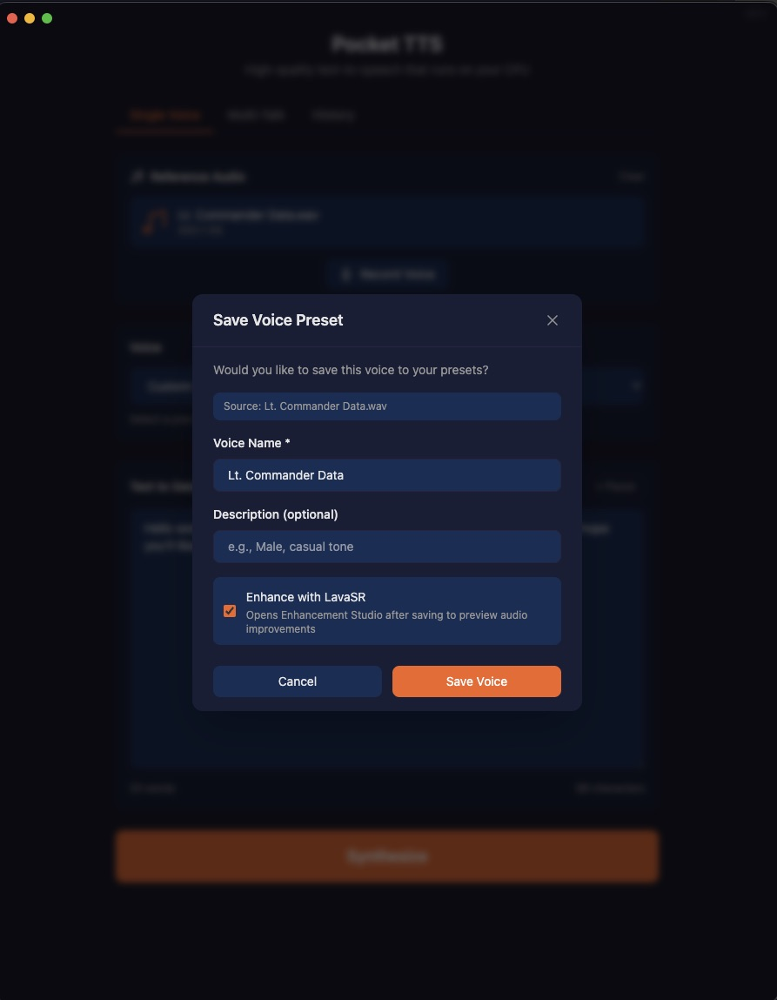
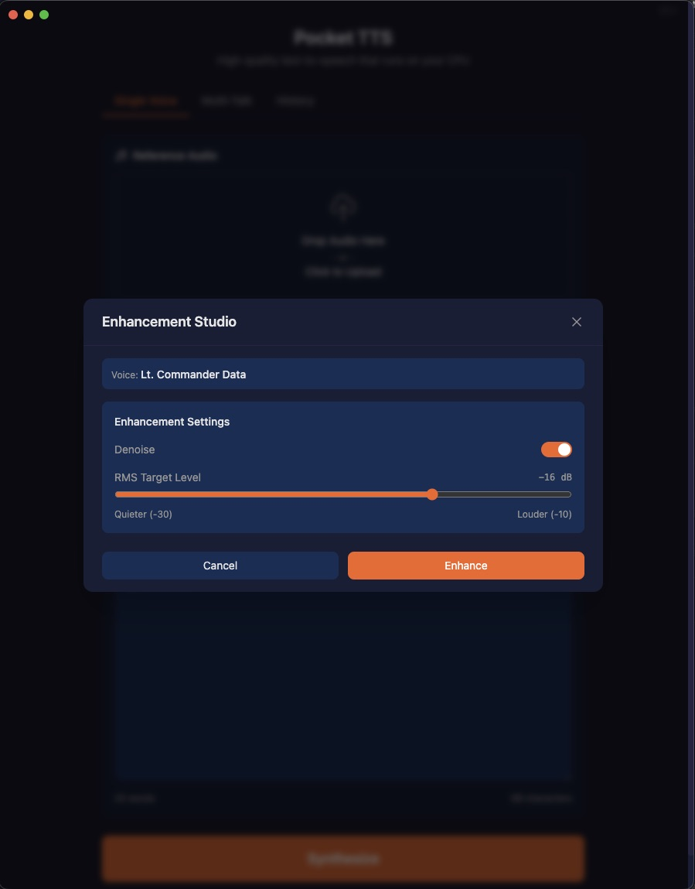
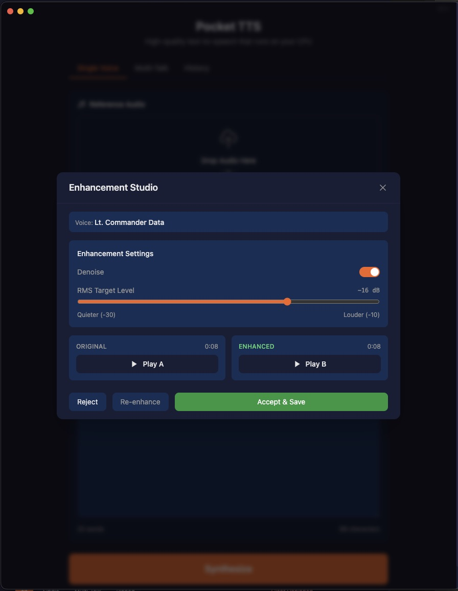

# Pocket TTS — macOS Desktop Fork


A macOS-native fork of [Kyutai's Pocket TTS](https://github.com/kyutai-labs/pocket-tts) — a ~100M-parameter CPU-only text-to-speech engine. This fork wraps the original Python library in an Electron desktop app, a macOS Quick Action for system-wide text reading, and a Swift menu bar companion app. Voice enhancement via [LavaSR](https://github.com/ysharma3501/LavaSR) is integrated directly into the app.

> **Upstream:** [kyutai-labs/pocket-tts](https://github.com/kyutai-labs/pocket-tts) · [Demo](https://kyutai.org/pocket-tts) · [HuggingFace](https://huggingface.co/kyutai/pocket-tts) · [Paper](https://arxiv.org/abs/2509.06926)

## What This Fork Adds

| Feature | Description |
|---|---|
| **Electron Desktop App** | Dark-themed GUI with voice management, streaming playback, multi-talk mode, and history |
| **LavaSR Enhancement Studio** | A/B preview of enhanced vs original voice samples before committing — self-bootstrapping venv, no external setup |
| **macOS Quick Action** | Select text anywhere → right-click → "Read Selection with Pocket TTS" — streams audio via ffplay |
| **Menu Bar App** | Native Swift app for voice selection and TTS server monitoring |
| **LaunchAgent** | Auto-starts the TTS server on login (port 8765) |
| **Text Normalizer** | Numbers, currencies, abbreviations, acronyms, ISR/radar terms → speakable words |
| **Pause/Resume/Stop** | Client-side audio controls + server-side cancellation |

## Screenshots

<p align="center">
  
</p>

https://github.com/user-attachments/assets/20c9442f-549c-4d97-aa9b-f0b8b75218fb

<p align="center">
  
</p>

## Requirements

- macOS (Apple Silicon recommended)
- Python 3.10–3.14
- [uv](https://docs.astral.sh/uv/getting-started/installation/) (Python package manager)
- Node.js 18+ and npm (for Electron)
- [ffplay](https://formulae.brew.sh/formula/ffmpeg) (for Quick Action streaming — `brew install ffmpeg`)
- PyTorch ≥ 2.5 (CPU build, installed automatically)

## Quick Start

```bash
# 1. Clone and install Python package
git clone https://github.com/slaughters85j/pocket-tts.git
cd pocket-tts
uv pip install -e .

# 2. Run the Electron app in dev mode
cd electron && npm install && npm run dev

# 3. Or start the TTS server directly
uv run pocket-tts serve --port 8765
```

## Building

There are several ways to build depending on what changed. Read this section carefully — it will save you headaches.

### Rebuild Everything (recommended after pulling changes)

```bash
./scripts/rebuild-all.sh
```

This runs all steps in order:
1. Python editable install (`uv pip install -e .`)
2. Electron app — npm install, PyInstaller bundle, electron-builder, copy to `/Applications/`
3. macOS Quick Action + Menu Bar App — Swift builds, workflow install
4. LaunchAgent restart

Flags:
```bash
./scripts/rebuild-all.sh --skip-electron   # Python + macOS only
./scripts/rebuild-all.sh --skip-macos      # Python + Electron only
```

### Electron-Only Rebuild (UI/renderer changes, no Python changes)

If you only changed TypeScript/React code and the Python server bundle is already built, use this. It's significantly faster than a full rebuild:

```bash
cd electron && rm -rf out release && npm run build:electron \
  && killall "Pocket TTS" 2>/dev/null; \
  rm -rf "/Applications/Pocket TTS.app" \
  && cp -R "release/mac-arm64/Pocket TTS.app" /Applications/ \
  && open "/Applications/Pocket TTS.app"
```

> **Why `rm -rf out release`?** Without it, electron-builder may repackage stale assets. The content-hashed JS filenames look fresh but the asar can contain old code. Always nuke `out/` and `release/` for a clean build.

### Python Changes Only

Source changes to `pocket_tts/` take effect immediately for `uv run` and the LaunchAgent (editable install). No rebuild needed unless:

- **New dependency added to `pyproject.toml`**: Re-run from project root:
  ```bash
  uv pip install -e .
  ```

- **Changes need to be in the Electron distributable**: The Electron app bundles Python via PyInstaller, so you must re-bundle:
  ```bash
  uv pip install -e .
  cd electron/python && ./bundle-python.sh
  cd .. && npm run build:electron
  ```

### macOS Quick Action Only

```bash
cd macos-service/scripts && ./install-quick-action.sh
```

### Menu Bar App Only

```bash
cd macos-service/scripts && ./dev-test.sh
```

### Dev Mode (no build needed)

```bash
cd electron && npm run dev
```

Hot-reloads renderer changes. The dev server connects to whatever TTS server is running on port 8765.

## LavaSR Voice Enhancement

The app integrates [LavaSR](https://github.com/ysharma3501/LavaSR) for speech super-resolution and denoising of voice samples. Enhancement is fully self-bootstrapping:

1. First time you click **"Set Up LavaSR"** in the Save Voice modal or Voice Selector, the app creates a dedicated venv at `~/Library/Application Support/pocket-tts-electron/lavasr-venv/` and installs torch, torchaudio, soundfile, and LavaSR from GitHub via `uv`.
2. Once set up, the **Enhancement Studio** lets you preview enhanced vs original audio side-by-side before committing.
3. Enhanced voices are tagged in `voices.json` with metadata (denoise settings, RMS normalization).

No external scripts or manual venv management required — it just works.

<p align="center">
  <br/>
  <br/>
  
</p>

## macOS Quick Action

System-wide text-to-speech from any application.

### Setup

1. Install: `cd macos-service/scripts && ./install-quick-action.sh`
2. Enable in System Settings → Keyboard → Shortcuts → Services → find "Read Selection with Pocket TTS"
3. Optional: assign a keyboard shortcut (e.g., F19)
4. Start the server: `uv run pocket-tts serve --port 8765` (or install the LaunchAgent for auto-start)

### Usage

Select text anywhere → right-click → Services → "Read Selection with Pocket TTS". Audio streams immediately via ffplay.

### Logs

`~/Library/Logs/PocketTTS/tts-stream-YYYY-MM-DD.log`

## Menu Bar App

A native Swift menu bar app (`macos-service/PocketTTSMenuBar/`) for:
- Voice selection (syncs with Electron app and Quick Action)
- Server status monitoring
- Stop Speaking control

Built with AppKit (not SwiftUI App — fixes menu not appearing). Installed to `~/Applications/Pocket TTS Menu Bar.app`.

## Architecture (from upstream)

```
Text → SentencePiece tokenizer → LUTConditioner (embeddings)
                                       ↓
Audio prompt → Mimi encoder → voice state → FlowLMModel (CaLM) → latent frames
                                                                        ↓
                                                               Mimi decoder → PCM audio
```

- **Thread 1:** CaLM generates latent frames autoregressively (12.5 Hz, 80ms/frame)
- **Thread 2:** Mimi decoder converts latents to waveform in parallel
- **CPU-only** — GPU provides no speedup at this model size (~100M params)
- **Not thread-safe** — server does not support concurrent requests

## Testing

```bash
uv run pytest -n 3 -v                              # all tests (3 parallel workers)
uv run pytest tests/test_cli_generate.py -v         # single file
uv run pytest tests/test_cli_generate.py -k "name"  # single test
```

## Linting

Ruff via pre-commit. Line length 100, LF endings, relative imports banned.

```bash
uvx pre-commit install          # one-time setup
uvx pre-commit run --all-files  # manual run
```

## Gotchas

- **PyTorch < 2.5** produces incorrect audio. Enforced in `pyproject.toml`.
- **Python 3.10–3.14 only.** `uv` manages its own Python — system Python may lack headers.
- **Electron won't load?** Check `ELECTRON_RUN_AS_NODE` is not set: `unset ELECTRON_RUN_AS_NODE`
- **Voice cloning** requires gated HF model access (`uvx hf auth login`). Predefined voices work without auth.
- **Editable install** means Python source changes are live immediately. New deps require `uv pip install -e .` from project root.
- **Electron distributable** bundles PyInstaller output, not source — must re-bundle after Python changes.

## Prohibited Use

Use of our model must comply with all applicable laws and regulations and must not result in, involve, or facilitate any illegal, harmful, deceptive, fraudulent, or unauthorized activity. Prohibited uses include, without limitation, voice impersonation or cloning without explicit and lawful consent; misinformation, disinformation, or deception (including fake news, fraudulent calls, or presenting generated content as genuine recordings of real people or events); and the generation of unlawful, harmful, libelous, abusive, harassing, discriminatory, hateful, or privacy-invasive content. We disclaim all liability for any non-compliant use.

## Authors

**Upstream (Kyutai):** Manu Orsini*, Simon Rouard*, Gabriel De Marmiesse*, Václav Volhejn, Neil Zeghidour, Alexandre Défossez (*equal contribution)

**This fork:** John Saunders — Electron app, LavaSR integration, macOS Quick Action, Menu Bar app, text normalizer, pause/resume/stop controls, reusable creations with metadata, .mp3/.mpa/.wav export
