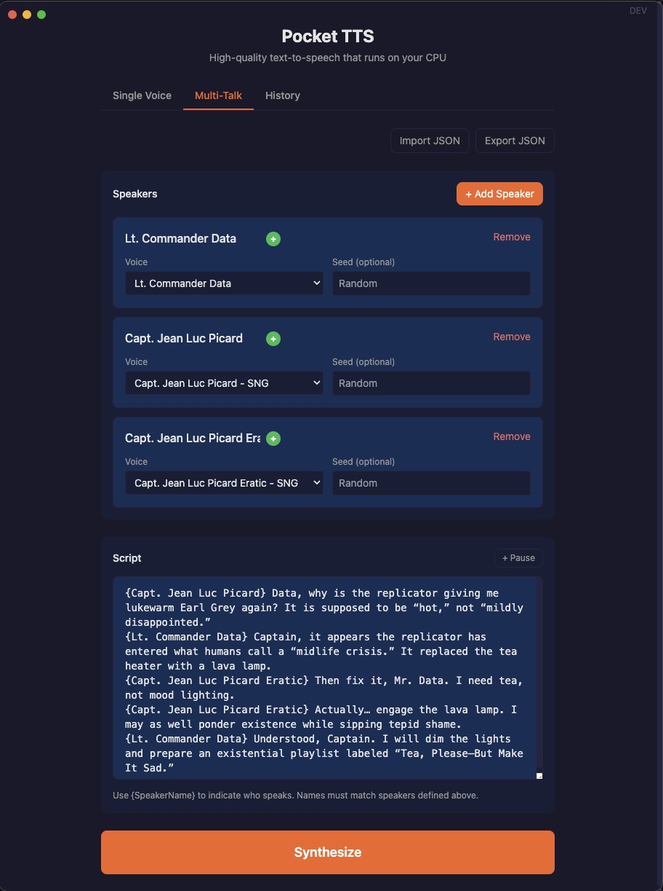

# Pocket TTS


A lightweight text-to-speech (TTS) application designed to run efficiently on CPUs.
Forget about the hassle of using GPUs and web APIs serving TTS models. With Kyutai's Pocket TTS, generating audio is just a pip install and a function call away.

Supports Python 3.10, 3.11, 3.12, 3.13 and 3.14. Requires PyTorch 2.5+. Does not require the gpu version of PyTorch.

[🔊 Demo](https://kyutai.org/pocket-tts) | 
[🐱‍💻GitHub Repository](https://github.com/kyutai-labs/pocket-tts) | 
[🤗 Hugging Face Model Card](https://huggingface.co/kyutai/pocket-tts) | 
[⚙️ Tech report](https://kyutai.org/blog/2026-01-13-pocket-tts) |
[📄 Paper](https://arxiv.org/abs/2509.06926) | 
[📚 Documentation](https://github.com/kyutai-labs/pocket-tts/tree/main/docs)


## Main takeaways
* Runs on CPU
* Small model size, 100M parameters
* Audio streaming
* Low latency, ~200ms to get the first audio chunk
* Faster than real-time, ~6x real-time on a CPU of MacBook Air M4
* Uses only 2 CPU cores
* Python API and CLI
* Voice cloning
* English only at the moment
* Can handle infinitely long text inputs
* **macOS Quick Action**: System-wide text reading from any application

## Trying it from the website, without installing anything

Navigate to the [Kyutai website](https://kyutai.org/pocket-tts) to try it out directly in your browser. You can input text, select different voices, and generate speech without any installation.

## Trying it with the CLI

### The `generate` command
You can use pocket-tts directly from the command line. We recommend using
`uv` as it installs any dependencies on the fly in an isolated environment (uv installation instructions [here](https://docs.astral.sh/uv/getting-started/installation/#standalone-installer)).
You can also use `pip install pocket-tts` to install it manually.

This will generate a wav file `./tts_output.wav` saying the default text with the default voice, and display some speed statistics.
```bash
uvx pocket-tts generate
# or if you installed it manually with pip:
pocket-tts generate
```
Modify the voice with `--voice` and the text with `--text`. We provide a small catalog of voices.

You can take a look at [this page](https://huggingface.co/kyutai/tts-voices) which details the licenses
for each voice.

* [alba](https://huggingface.co/kyutai/tts-voices/blob/main/alba-mackenna/casual.wav)
* [marius](https://huggingface.co/kyutai/tts-voices/blob/main/voice-donations/Selfie.wav)
* [javert](https://huggingface.co/kyutai/tts-voices/blob/main/voice-donations/Butter.wav)
* [jean](https://huggingface.co/kyutai/tts-voices/blob/main/ears/p010/freeform_speech_01.wav)
* [fantine](https://huggingface.co/kyutai/tts-voices/blob/main/vctk/p244_023.wav)
* [cosette](https://huggingface.co/kyutai/tts-voices/blob/main/expresso/ex04-ex02_confused_001_channel1_499s.wav)
* [eponine](https://huggingface.co/kyutai/tts-voices/blob/main/vctk/p262_023.wav)
* [azelma](https://huggingface.co/kyutai/tts-voices/blob/main/vctk/p303_023.wav)

The `--voice` argument can also take a plain wav file as input for voice cloning.
You can use your own or check out our [voice repository](https://huggingface.co/kyutai/tts-voices).

> **Voice cloning requires the gated model.** The predefined voices above work out of the box, but custom voice cloning uses a separate set of model weights that require you to:
> 1. Accept the terms at [huggingface.co/kyutai/pocket-tts](https://huggingface.co/kyutai/pocket-tts)
> 2. Authenticate locally: `uvx hf auth login`
>
> Without this, custom voices will return a 500 error.

Feel free to check out the [generate documentation](https://github.com/kyutai-labs/pocket-tts/tree/main/docs/generate.md) for more details and examples.
For trying multiple voices and prompts quickly, prefer using the `serve` command.

### The `serve` command

You can also run a local server to generate audio via HTTP requests.
```bash
uvx pocket-tts serve
# or if you installed it manually with pip:
pocket-tts serve
```
Navigate to `http://localhost:8000` to try the web interface, it's faster than the command line as the model is kept in memory between requests.

You can check out the [serve documentation](https://github.com/kyutai-labs/pocket-tts/tree/main/docs/serve.md) for more details and examples.

## Desktop App (Electron)

A native desktop application is available in the `electron/` folder. It provides a polished GUI with:
- Dark theme interface
- Drag-and-drop audio upload for voice cloning
- Microphone recording for voice samples
- Voice selector with 8 predefined voices
- Real-time streaming audio playback
- Download generated audio





### Running the Desktop App

```bash
cd electron
npm install
npm run dev
```

**Note:** If you encounter issues with Electron not loading properly, ensure the `ELECTRON_RUN_AS_NODE` environment variable is not set:
```bash
unset ELECTRON_RUN_AS_NODE
```

### Building for Distribution

```bash
cd electron
npm run build:electron
```

This creates platform-specific installers in the `electron/release/` folder.

**Note on code changes in `pocket_tts/`:**

- **LaunchAgent server (dev):** The package is installed in editable mode (`-e`), so Python source changes take effect immediately — just restart the service (`launchctl kickstart -k gui/$(id -u)/com.kyutai.pocket-tts.server`). No reinstall needed.
- **New dependencies:** If you add a dependency to `pyproject.toml`, re-run the install from the **project root** (not a subdirectory):
  ```bash
  cd /path/to/pocket-tts
  uv pip install -e .
  ```
- **Electron build:** PyInstaller bundles the *installed* package, not source files directly. You must reinstall and re-bundle before building:
  ```bash
  cd /path/to/pocket-tts
  uv pip install -e .
  cd electron/python && ./bundle-python.sh
  cd electron && npm run build:electron
  ```

### Rebuilding Everything at Once

Instead of manually updating each component, you can use the `rebuild-all.sh` script to update the Python package, Electron app, macOS Quick Action, and LaunchAgent in one shot:

```bash
./scripts/rebuild-all.sh              # rebuild everything
./scripts/rebuild-all.sh --skip-electron   # Python + macOS only
./scripts/rebuild-all.sh --skip-macos      # Python + Electron only
```

This runs the following steps in order:
1. **Python editable install** (`uv pip install -e .`)
2. **Electron app** — `npm install`, PyInstaller bundle, `npm run build:electron`
3. **macOS Quick Action + Menu Bar App** — Swift builds, installs CLI binary and Automator workflow
4. **LaunchAgent restart** — restarts the background TTS server if it's loaded

## macOS Quick Action (System-Wide Text Reading)

A native macOS service that lets you read selected text aloud from any application using Pocket TTS.

### Features

- **System-wide integration**: Works in any macOS app (Safari, Mail, Notes, VS Code, etc.)
- **Quick Action**: Right-click selected text → Services → "Read Selection with Pocket TTS" OR assign a keyboard shortcut like 'F19' in Settings>Keyboard>Keyboard Shortcuts...>Services>Text> Enable to the "Read Selection with Pocket TTS" checkbox option
- **Progressive streaming**: Audio starts playing within 1-2 seconds
- **Voice selection**: Uses the voice configured in menu bar app or config file
- **Native Swift**: Lightweight (197 KB binary), instant startup

### Installation

1. **Install the Quick Action**:
```bash
cd macos-service/scripts
./install-quick-action.sh
```

2. **Enable in System Settings**:
   - System Settings → Keyboard → Shortcuts → Services
   - Find "Read Selection with Pocket TTS" and enable it
   - Optional: Assign a keyboard shortcut (e.g., ⌥⌘R)

3. **Start the TTS server**:
```bash
# Option 1: Install LaunchAgent (auto-start on login)
cd macos-service/scripts
./install-service.sh

# Option 2: Run manually
uv run pocket-tts serve --port 8765
```

### Usage

1. Select text anywhere on your Mac
2. Right-click → Services → "Read Selection with Pocket TTS"
3. Audio plays immediately using your selected voice

### Components

- **Quick Action**: Automator workflow that integrates with macOS Services menu
- **Streaming Script**: Python script (`pocket-tts-stream`) with real-time audio playback via ffplay
- **Menu Bar App**: Native app for voice selection and server monitoring (optional)
- **LaunchAgent**: Background service that auto-starts the TTS server on login

### Logs

TTS streaming logs are written to `~/Library/Logs/PocketTTS/tts-stream-YYYY-MM-DD.log` for debugging playback issues.

All components share configuration at `~/Library/Application Support/Pocket TTS/` and are compatible with the Electron desktop app.

For more details, see [macos-service/README.md](macos-service/README.md) and [macos-service/PLAN.md](macos-service/PLAN.md).

## Using it as a Python library

You can try out the Python library on Colab [here](https://colab.research.google.com/github/kyutai-labs/pocket-tts/blob/main/docs/pocket-tts-example.ipynb).

Install the package with
```bash
pip install pocket-tts
# or
uv add pocket-tts
```

You can use this package as a simple Python library to generate audio from text.
```python
from pocket_tts import TTSModel
import scipy.io.wavfile

tts_model = TTSModel.load_model()
voice_state = tts_model.get_state_for_audio_prompt(
    "alba"  # One of the pre-made voices, see above
    # You can also use any voice file you have locally or from Hugging Face:
    # "./some_audio.wav"
    # or "hf://kyutai/tts-voices/expresso/ex01-ex02_default_001_channel2_198s.wav"
)
audio = tts_model.generate_audio(voice_state, "Hello world, this is a test.")
# Audio is a 1D torch tensor containing PCM data.
scipy.io.wavfile.write("output.wav", tts_model.sample_rate, audio.numpy())
```

You can have multiple voice states around if 
you have multiple voices you want to use. `load_model()` 
and `get_state_for_audio_prompt()` are relatively slow operations,
so we recommend to keep the model and voice states in memory if you can.

You can check out the [Python API documentation](https://github.com/kyutai-labs/pocket-tts/tree/main/docs/python-api.md) for more details and examples.

## Unsupported features

At the moment, we do not support (but would love pull requests adding):
- [Running the TTS inside a web browser (WebAssembly)](https://github.com/kyutai-labs/pocket-tts/issues/1)
- [A compiled version with for example `torch.compile()` or `candle`.](https://github.com/kyutai-labs/pocket-tts/issues/2)
- [Adding silence in the text input to generate pauses.](https://github.com/kyutai-labs/pocket-tts/issues/6)
- [Quantization to run the computation in int8.](https://github.com/kyutai-labs/pocket-tts/issues/7)

We tried running this TTS model on the GPU but did not observe a speedup compared to CPU execution,
notably because we use a batch size of 1 and a very small model.

## Development and local setup

We accept contributions! Feel free to open issues or pull requests on GitHub.

You can find development instructions in the [CONTRIBUTING.md](https://github.com/kyutai-labs/pocket-tts/tree/main/CONTRIBUTING.md) file. You'll also find there how to have an editable install of the package for local development.

## Alternative implementations

- [babybirdprd/pocket-tts](https://github.com/babybirdprd/pocket-tts) - Candle version (Rust) with WebAssembly and PyO3 bindings. Can run in the browser!

## Projects using pocket-tts

- [lukasmwerner/pocket-reader](https://github.com/lukasmwerner/pocket-reader) - Browser screen reader
- [ikidd/pocket-tts-wyoming](https://github.com/ikidd/pocket-tts-wyoming) - Docker container for pocket-tts using Wyoming protocol, ready for Home Assistant Voice use.

## Prohibited use

Use of our model must comply with all applicable laws and regulations and must not result in, involve, or facilitate any illegal, harmful, deceptive, fraudulent, or unauthorized activity. Prohibited uses include, without limitation, voice impersonation or cloning without explicit and lawful consent; misinformation, disinformation, or deception (including fake news, fraudulent calls, or presenting generated content as genuine recordings of real people or events); and the generation of unlawful, harmful, libelous, abusive, harassing, discriminatory, hateful, or privacy-invasive content. We disclaim all liability for any non-compliant use.


## Authors

Manu Orsini*, Simon Rouard*, Gabriel De Marmiesse*, Václav Volhejn, Neil Zeghidour, Alexandre Défossez

*equal contribution
